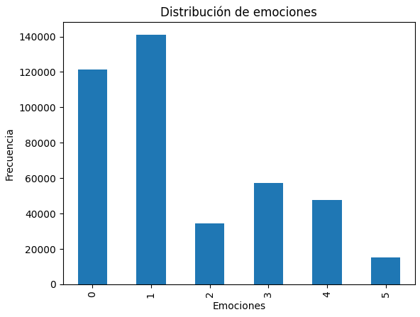
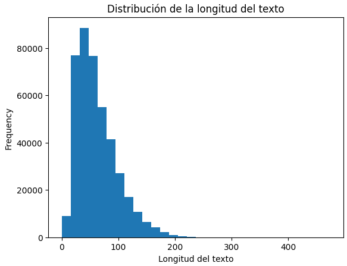

# Final Project NLP

## DATASET

Enlace de kaggle de la data:

`https://www.kaggle.com/datasets/aadyasingh55/twitter-emotion-classification-dataset/code`

## Análisis

Para realizar un proceso de análisis del texto primero realizamos normalización del mismo

```py
import re

def normalize_text(text):
    text = text.lower()
    text = re.sub(r'[^\w\s]', '', text)
    text = re.sub(r'\d+', '', text)
    return text

df['text'] = df['text'].apply(normalize_text)
```

Las expresiones regulares utilizadas quitan los caracteres especiales y los números

Continuamos retirando las stop_words con la librería nltk

```py
from nltk.corpus import stopwords

import nltk
nltk.download('stopwords')

stop_words = set(stopwords.words('english'))

def remove_stopwords(text):
    words = text.split()
    return ' '.join([word for word in words if word not in stop_words])

df['text'] = df['text'].apply(remove_stopwords)

```

Luego realizamos un conteo por cada tipo de label y conocer la distribución

```py
label_counts = df['label'].value_counts().sort_index()
print(label_counts)

label_counts.plot(kind='bar', title='Distribución de emociones', xlabel='Emociones', ylabel='Frecuencia')
plt.show()
```

```txt
label
0    121187
1    141067
2     34554
3     57317
4     47712
5     14972
```





También revisamos la proporción por label

```py
label_proportion = df['label'].value_counts(normalize=True)
print(label_proportion)
```


```txt
label
1    0.338445
0    0.290749
3    0.137514
4    0.114470
2    0.082901
5    0.035921
```

Continuamos revisando si hay alguna relación de la longitud del texto con el label

```py
df['text_length'] = df['text'].apply(len)
print(df['text_length'].describe())
```

```txt
count    416809.000000
mean         61.718811
std          35.378303
min           0.000000
25%          35.000000
50%          54.000000
75%          81.000000
max         474.000000
```

Revisamos la distribución de los datos

```py
df['text_length'].plot(kind='hist', bins=30, title='Distribución de la longitud del texto')
plt.xlabel('Longitud del texto')
plt.show()
```



Revisamos la longitud por label

```py
length_by_label = df.groupby('label')['text_length'].describe()
print(length_by_label)
```

```txt
          count       mean        std   min   25%   50%   75%    max
label                                                               
0      121187.0  59.419418  34.988122   0.0  33.0  52.0  78.0  323.0
1      141067.0  62.769762  35.403254   0.0  36.0  55.0  82.0  282.0
2       34554.0  65.960960  35.856218   8.0  39.0  59.0  86.0  249.0
3       57317.0  60.917267  35.678358   0.0  34.0  53.0  80.0  474.0
4       47712.0  61.853475  35.204518   0.0  35.0  54.0  81.0  252.0
5       14972.0  63.277451  35.168865  10.0  37.0  56.0  82.0  248.0
```

Luego revisamos las 20 palabras más frecuentes

```py
from collections import Counter

word_counts = Counter(" ".join(df['text']).split())
most_common_words = word_counts.most_common(20)
print("Palabras más comunes:", most_common_words)
```

```txt
Palabras más comunes: [('feel', 289939), ('feeling', 134185), ('like', 73972), ('im', 61662), ('really', 25862), ('know', 23766), ('time', 21292), ('get', 19571), ('little', 19193), ('people', 18125), ('would', 17961), ('want', 16441), ('one', 16041), ('think', 15871), ('still', 15747), ('ive', 14866), ('even', 14850), ('much', 14426), ('life', 14009), ('something', 13417)]

```

Y finalmente palabras más comunes por label serían la siguiente:

```py
for label in df['label'].unique():
    texts = df[df['label'] == label]['text']
    word_counts = Counter(" ".join(texts).split())
    print(f"Palabras más comunes para la emoción {label}: {word_counts.most_common(10)}")
```

```txt
Palabras más comunes para la emoción 0: [('feel', 84184), ('feeling', 40849), ('like', 22167), ('im', 17631), ('really', 7533), ('know', 7183), ('time', 6133), ('little', 5719), ('get', 5410), ('ive', 5172)]
Palabras más comunes para la emoción 1: [('feel', 102709), ('feeling', 40953), ('like', 25245), ('im', 20445), ('really', 8506), ('time', 7323), ('know', 7159), ('get', 6523), ('would', 5916), ('people', 5794)]
Palabras más comunes para la emoción 2: [('feel', 24463), ('feeling', 10303), ('like', 7558), ('im', 4775), ('love', 2365), ('really', 2247), ('know', 2077), ('people', 1705), ('would', 1694), ('time', 1690)]
Palabras más comunes para la emoción 3: [('feel', 37717), ('feeling', 19236), ('like', 10367), ('im', 9298), ('really', 3771), ('know', 3399), ('get', 3340), ('people', 3074), ('time', 2937), ('little', 2826)]
Palabras más comunes para la emoción 4: [('feel', 30913), ('feeling', 17673), ('im', 7550), ('like', 6260), ('little', 3518), ('know', 3040), ('really', 2800), ('bit', 2424), ('time', 2418), ('still', 2390)]
Palabras más comunes para la emoción 5: [('feel', 9953), ('feeling', 5171), ('like', 2375), ('im', 1963), ('amazed', 1415), ('impressed', 1414), ('weird', 1413), ('strange', 1400), ('overwhelmed', 1391), ('surprised', 1389)]
```

## Preprocesamiento de Datos de Twitter para Clasificación de Emociones

### Descripción del Script

El script tiene dos funciones principales:

1. **Dividir el conjunto de datos en entrenamiento y validación**
2. **Preprocesar los datos para formatearlos adecuadamente para la clasificación de emociones**

El código divide los datos proporcionados en un conjunto de entrenamiento y uno de validación. Luego, realiza una conversión de etiquetas a emociones, así como un formato de salida adecuado que puede ser utilizado por un modelo de lenguaje.

### Estructura del Código

#### Importación de Bibliotecas

Importamos la biblioteca `pandas` para manejar y procesar los datos.
```python
import pandas as pd
```

#### Definición de la Función `preprocess_twitter_data`

```python
def preprocess_twitter_data(input_parquet, output_file):
    label_to_emotion = {
        0: "sadness",
        1: "joy",
        2: "love",
        3: "anger",
        4: "fear",
        5: "surprise"
    }
    
    df = pd.read_csv(input_parquet)
    df['emotion'] = df['label'].map(label_to_emotion)
    df['formatted'] = df['emotion'].apply(lambda x: f"<{x}>") + " " + df['text']
    
    with open(output_file, 'w', encoding='utf-8') as f:
        f.write("\n".join(df['formatted']))

    print(f"Datos preprocesados guardados en {output_file}")
```

La función `preprocess_twitter_data` realiza las siguientes tareas:

- Mapea los valores de las etiquetas (`label`) a emociones (“joy”, “sadness”, etc.) usando el diccionario `label_to_emotion`.
- Formatea los datos agregando una etiqueta textual de la emoción antes del texto original, por ejemplo: `<joy> texto_del_tweet`.
- Escribe los datos preprocesados en un archivo de texto.

#### Función principal

```python
if __name__ == "__main__":
    input_parquet = "corpus/train-00000-of-00001.parquet"
    output_file_train = "data/train.txt"
    output_file_valid = "data/valid.txt"
    
    df = pd.read_parquet(input_parquet)
    train_df = df.sample(frac=0.8, random_state=42)
    valid_df = df.drop(train_df.index)
    
    train_df.to_csv("data/train_data.csv", index=False)
    valid_df.to_csv("data/valid_data.csv", index=False)

    preprocess_twitter_data("data/train_data.csv", output_file_train)
    preprocess_twitter_data("data/valid_data.csv", output_file_valid)
```

En la sección principal del código se lleva a cabo lo siguiente:

1. **Cargar el archivo de entrada**: Se carga un archivo `parquet` que contiene los datos originales.
2. **Dividir los datos**: Los datos se dividen en un conjunto de entrenamiento (80%) y un conjunto de validación (20%).
3. **Guardar conjuntos de entrenamiento y validación**: Se exportan los conjuntos resultantes a archivos CSV.
4. **Preprocesar y guardar los datos formateados**: Los conjuntos de entrenamiento y validación se formatean y se guardan en archivos de texto (`train.txt` y `valid.txt`).

### Archivos Resultantes

- **data/train_data.csv**: Contiene los datos de entrenamiento en formato CSV.
- **data/valid_data.csv**: Contiene los datos de validación en formato CSV.
- **data/train.txt**: Conjunto de entrenamiento preprocesado en un formato adecuado para el modelo.
- **data/valid.txt**: Conjunto de validación preprocesado en un formato adecuado para el modelo.

## Entrenamiento de un Modelo GPT-2 para Generación de Texto Condicional

Se elaboró un script en Python utilizado para entrenar un modelo de lenguaje GPT-2 para la generación de texto condicional basado en emociones. El código se basa en la librería `transformers` de Hugging Face, que permite la personalización y entrenamiento de modelos de lenguaje previamente entrenados, como GPT-2.

### Importación de Bibliotecas

Se realizó la importación de las librerías `torch` y `transformers` que se utilizan para manejar los aspectos principales del modelo, la tokenización y el entrenamiento.

```python
import torch
from transformers import GPT2Tokenizer, GPT2LMHeadModel, Trainer, TrainingArguments, TextDataset, DataCollatorForLanguageModeling
```

### Definir el Dispositivo de Entrenamiento

```python
device = "cuda" if torch.cuda.is_available() else "cpu"
```

Primero detectamos si poseemos una gpu para poder usarla

### Preprocesamiento del Dataset

```python
def preprocess_dataset(file_path, tokenizer):
    dataset = TextDataset(
        tokenizer=tokenizer,
        file_path=file_path,
        block_size=128
    )
    return dataset
```

La función `preprocess_dataset` carga un conjunto de datos a partir de un archivo de texto, utilizando el tokenizador proporcionado. Los datos se dividen en bloques de 128 tokens para su procesamiento durante el entrenamiento.

### Función de Entrenamiento del Modelo

```python
def train_model(train_file, valid_file, output_dir):
    model_name = "gpt2"
    tokenizer = GPT2Tokenizer.from_pretrained(model_name)
    model = GPT2LMHeadModel.from_pretrained(model_name).to(device)
```

La función `train_model` comienza cargando el modelo preentrenado GPT-2 y el tokenizador asociado. El modelo se mueve al dispositivo adecuado (GPU o CPU).

#### Agregar Tokens Personalizados

```python
    emotions = ["sadness", "joy", "love", "anger", "fear", "surprise"]
    for emotion in emotions:
        tokenizer.add_tokens(f"<{emotion}>")
    model.resize_token_embeddings(len(tokenizer))
```

Se agregan etiquetas especiales para representar las emociones (`<sadness>`, `<joy>`, etc.). Esto permite que el modelo genere texto de manera condicional basado en la emoción especificada. El tamaño del vocabulario del modelo se ajusta para incluir estos nuevos tokens.

#### Preprocesar Conjuntos de Datos de Entrenamiento y Validación

```python
    train_dataset = preprocess_dataset(train_file, tokenizer)
    valid_dataset = preprocess_dataset(valid_file, tokenizer)
```

Los conjuntos de entrenamiento y validación se preprocesan utilizando la función `preprocess_dataset` previamente definida.

#### Configuración del Colaborador de Datos

```python
    data_collator = DataCollatorForLanguageModeling(
        tokenizer=tokenizer, mlm=False
    )
```

Se utiliza `DataCollatorForLanguageModeling` para manejar la agrupación de datos durante el entrenamiento. El argumento `mlm=False` indica que no se utilizará enmascaramiento de lenguaje (MLM), ya que GPT-2 se basa en un modelo de lenguaje autoregresivo.

#### Configuración de Argumentos de Entrenamiento

```python
    training_args = TrainingArguments(
        output_dir=output_dir,
        overwrite_output_dir=True,
        num_train_epochs=50,
        per_device_train_batch_size=8,
        save_steps=500,
        save_total_limit=2,
        logging_dir="./logs",
        logging_steps=100,
        evaluation_strategy="steps",
        eval_steps=500,
        learning_rate=5e-5,
        warmup_steps=100,
        weight_decay=0.01,
        push_to_hub=False
    )
```

Se establecen los argumentos de entrenamiento, como el número de épocas, el tamaño del lote de entrenamiento (`per_device_train_batch_size=8`), y la frecuencia de guardado y evaluación. También se define una tasa de aprendizaje de `5e-3` y se aplica un decaimiento del peso (`weight_decay=0.01`) para evitar el sobreajuste.

#### Definir y Ejecutar el Entrenador

```python
    trainer = Trainer(
        model=model,
        args=training_args,
        train_dataset=train_dataset,
        eval_dataset=valid_dataset,
        data_collator=data_collator,
    )

    trainer.train()
```

Se utiliza la clase `Trainer` de Hugging Face para manejar el proceso de entrenamiento del modelo. Se especifican el modelo, los argumentos de entrenamiento, los conjuntos de datos y el colaborador de datos.

#### Guardar el Modelo Entrenado

```python
    trainer.save_model(output_dir)
    print(f"Modelo guardado en {output_dir}")
```

Una vez finalizado el entrenamiento, el modelo se guarda en el directorio especificado (`output_dir`).

### Ejecución del Script

```python
if __name__ == "__main__":
    train_file = "data/train.txt"
    valid_file = "data/valid.txt"
    output_dir = "model/emotion_generator"

    train_model(train_file, valid_file, output_dir)
```

En la sección principal del script, se especifican los archivos de entrada de entrenamiento y validación, así como el directorio de salida donde se almacenará el modelo entrenado. Luego se llama a la función `train_model` para comenzar el entrenamiento.
